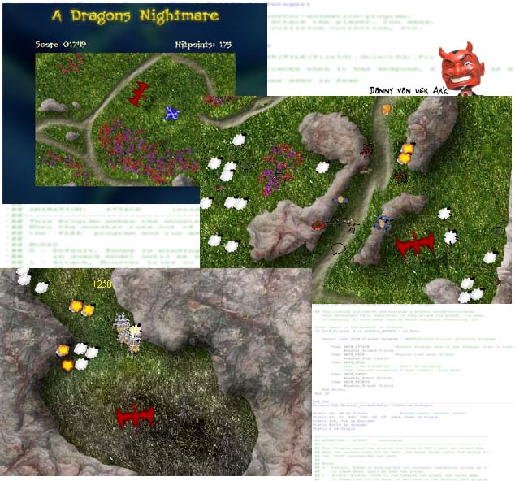



## Dragon Rider

### Description

PLEASE CHECK THE SCREENSHOT! DragonRider uses dozens of techniques and tricks to display dozens of sprites with complex animations, visual effects, sound effects, collision-detection, complex character animation, etc. The screenshot sais a lot. Check the readme file for more detailed info! Any comments, ideas, VOTES, suggestions, tips, etc. are very welcome !!!! Music and Sound effects unfortunately had to be removed to keep the filesize down,

anyway, Enjoy.  Danny,--

EXPLANATION TEXT:

This code is a tribute to PSCode.com since a lot of the routines are taken or 'heavily inspired' from other contributions made to this site. For

example: FPSLimiter class by Geoffrey Hazen, Path Finding (not implemented

yet) by Jonas Ask, DX7Sound Playback by Derek Hall, FoxCBmp Library 3.3 by Florian Egel, Collision Detection by Richard Lowe, to name a few. Please note this is WORK IN PROGRESS !
 
### More Info
 

             |
---                |---
**Submitted On**   |2002-07-19 11:12:52
**By**             |[DANNY van der Ark](https://github.com/Planet-Source-Code/PSCIndex/blob/master/ByAuthor/danny-van-der-ark.md)
**Level**          |Advanced
**User Rating**    |4.6 (32 globes from 7 users)
**Compatibility**  |VB 6\.0
**Category**       |[Games](https://github.com/Planet-Source-Code/PSCIndex/blob/master/ByCategory/games__1-38.md)
**World**          |[Visual Basic](https://github.com/Planet-Source-Code/PSCIndex/blob/master/ByWorld/visual-basic.md)
**Archive File**   |[Dragon\_Rid1100027242002\.zip](https://github.com/Planet-Source-Code/danny-van-der-ark-dragon-rider__1-37228/archive/master.zip)

